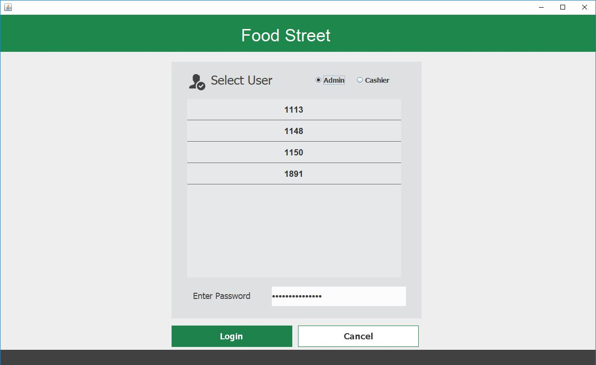
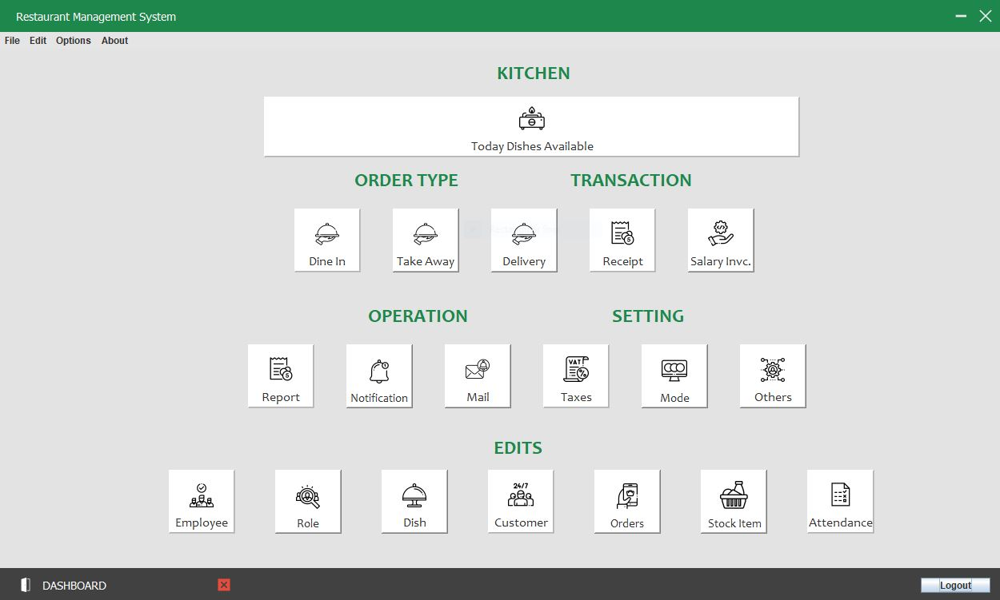
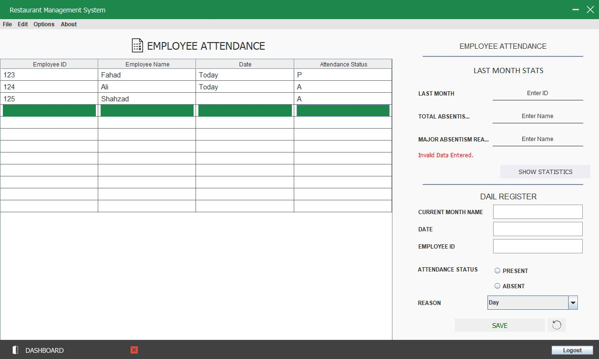
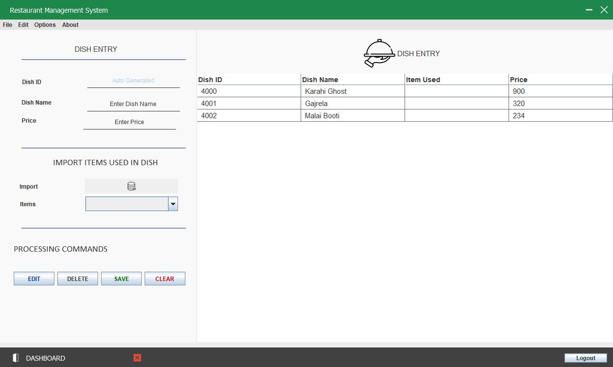
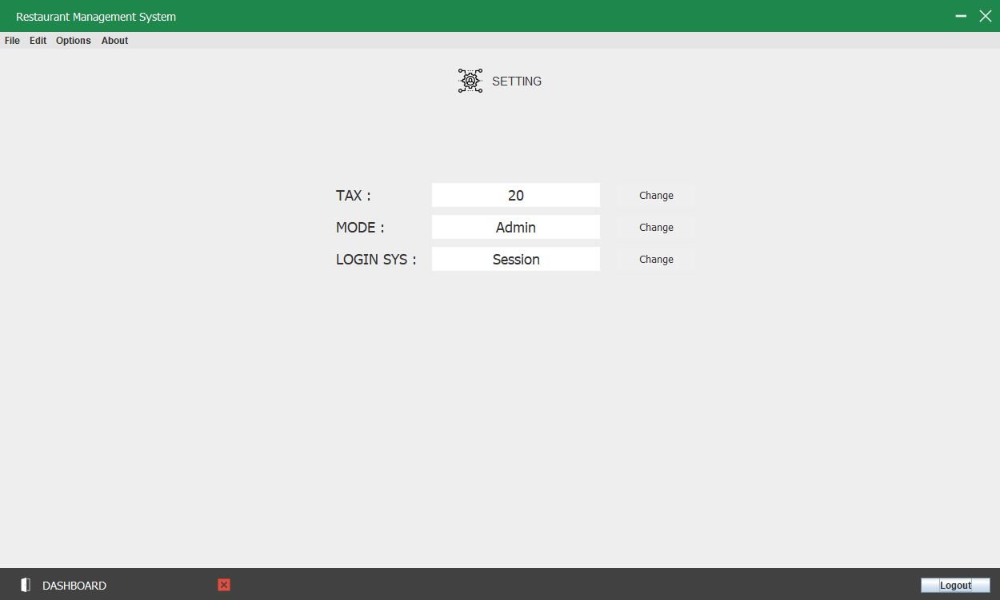
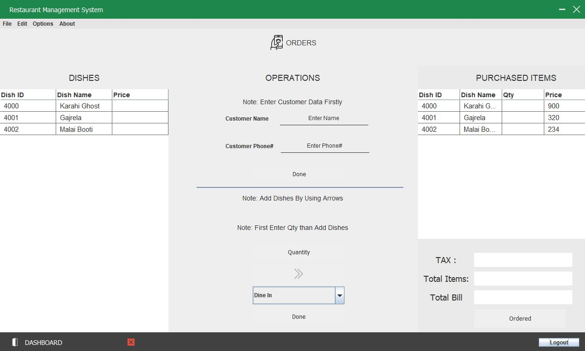

# Restaurant Management system (GUI)

## Contributors

| Name  | GitHub Profile |
| ------------- |:-------------:|
| Muhammad Shahzad Ali      | [link](https://github.com/shahzad6077)     |
| Abdul Aziz      | [link](https://github.com/approachaziz)     |

## Technologoies used

| Name  | Description |
| ------------- |:-------------:|
| Java      | Developed GUI     |
| SQL Server      | Used as a database     |

## Application Previews

### 1

### 2

### 3

### 4

### 5

### 6

